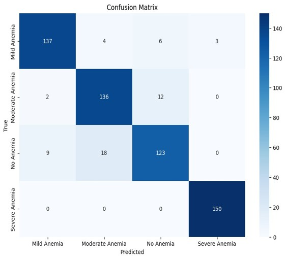

# 👁️ CHAT: Conjunctival Hemoglobin Assessment Tool

   

> **An AI-powered diagnostic system for non-invasive Anemia detection.**

The **Anemia Detection System (CHAT)** is a deep learning solution engineered to classify the severity of anemia by analyzing real-time images of the patient's eye conjunctiva. By replacing traditional invasive blood sampling with advanced computer vision, this tool significantly enhances accessibility and affordability for early diagnosis in clinical and remote environments.

---

## 🏥 Clinical & Technical Motivation

**The Problem:** Traditional anemia detection requires invasive blood tests (CBC), which are painful, expensive, and logistically difficult in resource-limited settings.
**The Solution:** The human conjunctiva's pallor is a direct clinical indicator of hemoglobin levels. CHAT automates this diagnostic process using a multi-stage Deep Learning pipeline to provide instant, needle-free classification.

---

## 🚀 Key Features

* **Non-Invasive Diagnostics:** Eliminates needles entirely; relies solely on real-time visual analysis.
* **Deep Learning Pipeline:** A robust multi-model architecture combining **YOLOv8** (Detection), **U-Net** (Segmentation), and **MobileNetV3** (Classification).
* **Real-Time Processing:** Optimized for instant feedback, making it suitable for live clinical deployment.
* **Multi-Class Severity Grading:** Accurately categorizes patients into four clinical levels:
    * **No Anemia**
    * **Mild Anemia**
    * **Moderate Anemia**
    * **Severe Anemia**
* **High Clinical Accuracy:** Achieved a validated accuracy of **94.75%** on real-world clinical datasets.

---

## 🧠 System Architecture (The Pipeline)

The system strength lies in its modular pipeline, ensuring only the most relevant visual data (the conjunctiva) is passed to the classifier.


*Figure 1: End-to-End Execution Flow: Detection -> Segmentation -> Classification.*

### 1. 👁️ Eye Detection (YOLOv8)
The raw input image is first processed by **YOLOv8**. This model automatically locates the eye, cropping out irrelevant background noise (skin, nose, environment) to focus the system on the relevant anatomy.

### 2. ✂️ Preprocessing & Filtering
Post-detection, the image undergoes:
* **Precise Cropping:** Using contour detection.
* **Standardization:** Resizing to 224x224 pixels.
* **Enhancement:** Brightness, Background, and Boundary filters are applied to normalize lighting conditions.

### 3. 🎯 Segmentation (U-Net + ResNet-34)
A **U-Net architecture** with a **ResNet-34 encoder** backbone isolates the specific **Region of Interest (ROI)**—the palpebral conjunctiva—from eyelashes and sclera. The skip connections in U-Net preserve high-resolution spatial details for a precise mask.


*Figure 2: U-Net Architecture used for precise ROI Segmentation.*

### 4. 📊 Classification (MobileNetV3-Large)
The segmented ROI is fed into a **Fine-Tuned MobileNetV3-Large** model. Chosen for its efficiency and transfer learning capabilities, this model predicts the specific anemia severity class.


*Figure 3: MobileNetV3 Architecture fine-tuned for Severity Classification.*

---

## 🛠️ Tech Stack

| Category | Technology | Purpose |
| :--- | :--- | :--- |
| **Language** | Python 3.11.4 | Core Implementation |
| **Framework** | TensorFlow / Keras | Model Training & Inference |
| **Detection** | YOLOv8 | Object Detection (Eye Localization) |
| **Segmentation** | U-Net (ResNet-34) | ROI Extraction (Conjunctiva Masking) |
| **Classification** | MobileNetV3-Large | Severity Prediction |
| **Processing** | OpenCV | Real-time Camera Access & Image Ops |
| **API** | FastAPI | Model Deployment Service |

---

## 📊 Performance Metrics

The model was validated against a clinically labeled dataset, demonstrating high reliability across all severity classes.

| Metric | Score |
| :--- | :--- |
| **Accuracy** | **94.75%** |
| **Precision** | 0.92 |
| **F1-Score** | 0.91 |


*Figure 4: Confusion Matrix demonstrating classification performance across the 4 severity levels.*

---

## 💻 Setup & Installation

### 1. Prerequisites
Ensure you have **Python 3.11.4** or higher installed.

### 2. Clone the Repository
```bash
git clone [https://github.com/YourUsername/Anemia-Detection-Eye-Conjunctiva-AI.git](https://github.com/YourUsername/Anemia-Detection-Eye-Conjunctiva-AI.git)
cd Anemia-Detection-Eye-Conjunctiva-AI

```

### 3. Install Dependencies

```bash
pip install -r requirements.txt

```

### 4. Model Setup

* Place your pre-trained `.h5` model files into the `./models/` directory.
* Ensure your `labeled_data.csv` is present in the `./data/` directory.

### 5. Run the System

To start the full real-time detection pipeline:

```bash
python src/main_pipeline.py

```

---

## 📄 License

This project is licensed under the MIT License - see the `LICENSE` file for details.

---

**Built with 💻 & 🧠 by Hrushikesh**

```

```